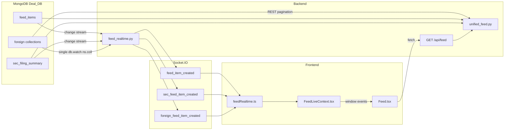

# Unified Feed & Live Socket — Implementation Reference

This document maps **where things live** in the repo so you can change behaviour manually later (new foreign collections, new Socket events, sorting windows, etc.). **Foreign filings include realtime Socket.IO** (single DB-level watcher); pagination remains **`GET /api/feed`** (cursor).

---

## 1. High-level architecture

| Layer | Behaviour |
|--------|-----------|
| **Press** (`feed_items`) | Change stream → `feed_item_created` → UI upsert when tab matches; **`deal_id`** required |
| **SEC** (`sec_filing_summary`) | Change stream → `sec_feed_item_created` → UI upsert |
| **Foreign** (`FOREIGN_COLLECTIONS`) | One **`db.watch`** (`ns.coll` ∈ list, `ns.db` = app DB) → `foreign_feed_item_created` → UI upsert on All / Foreign; **`deal_id`** required (same as REST foreign rows); **`/api/feed`** still paginates |

---

## 2. Backend — live Socket.IO & Mongo watchers

**File:** `backend/feed_realtime.py`

| Responsibility | Details |
|----------------|---------|
| **Socket.IO server** | Async `socketio.AsyncServer` mounted in ASGI — see `backend/main.py` (`ASGIApp(_feed_sio, other_asgi_app=app)`). |
| **Press watcher** | `Collection.watch` on `FEED_ITEMS_COLLECTION` (default `feed_items`). |
| **SEC watcher** | `Collection.watch` on `SEC_FILING_SUMMARY_COLLECTION` (default `sec_filing_summary`). |
| **Foreign watcher** | **`Database.watch`** on `get_db()` with `$match` on `operationType`, **`ns.db`**, and **`ns.coll`** ∈ `FOREIGN_COLLECTIONS` names (`_foreign_db_watch_pipeline`). |
| **Pipeline** | Press/SEC: `_CHANGE_STREAM_OPS`. Foreign: combined ns + operation filter (same insert/update/replace set). |
| **Full documents on update** | `_WATCH_KWARGS` includes `full_document="updateLookup"` so update/replace events include a materialized document. |
| **Resume** | Each loop stores `resume_token` from `change["_id"]` and passes `resume_after` when reconnecting after errors. |

**Emitted events**

| Event | When | Payload shape |
|-------|------|----------------|
| `feed_item_created` | After press doc passes filters | `{ "message": str, "data": <normalized doc> }` |
| `sec_feed_item_created` | After SEC doc is enriched | `{ "message": str, "data": <enriched doc> }` |
| `foreign_feed_item_created` | After foreign doc passes **`deal_id`** filter | `{ "message": str, "data": <doc + feed_type/source/source_label/country> }` |

**Press + foreign filter**

- Helper: `feed_item_has_deal_id` in `backend/db.py`.
- Only emits when `deal_id` is present and non-empty (aligned with **`feed_items_deal_id_query()`** on press and foreign in **`unified_feed.py`**).

**SEC enrichment**

- `enrich_sec_summary_record(db, doc)` from `backend/sec_feed_enrichment.py` (e.g. `company_name` from deals).

**Event loop bridge**

- `set_feed_emit_event_loop(loop)` is called from FastAPI lifespan so worker-thread watchers can schedule `sio.emit` on the main asyncio loop.

**Foreign payload**

- `normalize_foreign_feed_document` — JSON-safe, same shape as unified REST foreign rows.

**Startup wiring**

| File | What |
|------|------|
| `backend/main.py` | Lifespan calls `set_feed_emit_event_loop`, `ensure_feed_watcher_started()`, `ensure_sec_filing_summary_watcher_started()`, **`ensure_foreign_feed_watcher_started()`**. |

**Adding foreign collections**

- Edit **`backend/foreign_collections.py`** only — REST merge and Socket **`ns.coll`** filter both derive from `FOREIGN_COLLECTIONS`.

**Configuration**

| File | Variable |
|------|----------|
| `backend/config.py` | `FEED_ITEMS_COLLECTION`, `SEC_FILING_SUMMARY_COLLECTION` (code constants), `MONGODB_URI`, `MONGODB_DB` |

---

## 3. Backend — unified REST feed

**File:** `backend/unified_feed.py`  
**Route:** `GET /api/feed` in `backend/main.py` → `get_unified_feed(...)`.

**Query parameters**

| Param | Role |
|-------|------|
| `tab` | `all` \| `press` \| `sec` \| `foreign` |
| `page_size` | 1–100 |
| `days` | Window: **1**, **3**, or **7** only (invalid → **1**) |
| `search` | Substring filter (collection-specific fields) |
| `cursor` | Opaque cursor string (`next_cursor` from previous response); **cursor pagination**, not offset pages |

**Sorting**

- Press & SEC: primarily **`updated_at`** (fallback tie-break uses `_id` / ObjectId time where relevant).
- Foreign: **`updated_at`** except SAMR collections (`samr_cases`, `samr_conditional`, `samr_unconditional`) → **`processed_at`**, with sensible fallbacks (`unified_sort_ts`).

**Merge logic**

- Tab `all`: k-way merge across streams keyed in `stream_keys_all()` — `press`, `sec`, plus `f:<collection>` for each row in `FOREIGN_COLLECTIONS`.
- Tab `foreign`: merge only `f:<collection>` keys (`stream_keys_foreign_only()`).

**Identifiers**

- Cursors and merge logic support both ObjectId and string `_id` (e.g. UUID) via helpers like `_parse_cursor_id` / `_id_from_doc`.

**If you add a new foreign collection**

1. Add a tuple to **`backend/foreign_collections.py`** (`FOREIGN_COLLECTIONS`): `(collection_name, label, country)`.
2. If search-by-title needs a custom extractor, extend **`_foreign_title`** in `unified_feed.py` for that `col_name`.

---

## 4. Backend — related legacy paginated APIs

Still used by standalone pages or older clients:

| Route | File / helpers |
|-------|------------------|
| `GET /api/news-feed` | `backend/main.py` + `get_feed_items_col`, `feed_items_deal_id_query` (`backend/db.py`) |
| `GET /api/sec-feed` | `backend/main.py` + `enrich_sec_summary_record` |

Live Socket behaviour aligns with **deal_id** rules for **press + foreign** and **full SEC summary** rows for SEC.

---

## 5. Frontend — Socket client & global provider

| File | Role |
|------|------|
| `frontend/src/services/feedRealtime.ts` | Single `socket.io-client` … listens for **`feed_item_created`**, **`sec_feed_item_created`**, **`foreign_feed_item_created`**. |
| `frontend/src/context/FeedLiveContext.tsx` | `FeedLiveProvider`: connects socket, shows toasts, dispatches **`dashboard:news-feed-item`**, **`dashboard:sec-feed-item`**, **`dashboard:foreign-feed-item`**. |
| `frontend/src/components/ProtectedRoute.tsx` | Wraps authenticated subtree with `FeedLiveProvider`. |

**Window event constants**

| Constant | Socket source |
|----------|----------------|
| `DASHBOARD_NEWS_FEED_ITEM` (`dashboard:news-feed-item`) | `feed_item_created` |
| `DASHBOARD_SEC_FEED_ITEM` (`dashboard:sec-feed-item`) | `sec_feed_item_created` |
| **`DASHBOARD_FOREIGN_FEED_ITEM`** (`dashboard:foreign-feed-item`) | **`foreign_feed_item_created`** |

**Live list behaviour (important)**

- Pages **upsert** by `id`: remove existing row with same `id`, then prepend fresh payload so **updates** refresh and bubble to the top (matches insert/update/replace on the backend).

---

## 6. Frontend — unified `/feed` page

| File | Role |
|------|------|
| `frontend/src/pages/Feed.tsx` | Tabs **All / SEC / Press / Foreign**; **`GET /api/feed`**; listens for press / SEC / **foreign** `dashboard:*` events; live gating uses **`updated_at`** (SAMR: **`processed_at`**) for foreign + date/search filters. |
| `frontend/src/styles/Feed.css` | Layout, cards, live connection indicator, etc. |
| `frontend/src/App.tsx` | Route `/feed`; `/news-feed` and `/sec-feed` redirect to `/feed`. |
| `frontend/src/config/roleConfig.ts` | Nav visibility / paths for Feed (role-dependent). |

**Standalone feeds (still wired to same Socket events)**

| File | Notes |
|------|------|
| `frontend/src/pages/NewsFeed.tsx` | REST `/api/news-feed`; live prepend/upsert via `DASHBOARD_NEWS_FEED_ITEM`. |
| `frontend/src/pages/SecFeed.tsx` | REST `/api/sec-feed`; live via `DASHBOARD_SEC_FEED_ITEM`. |

---

## 7. Foreign filings live (implemented)

Implemented via **`foreign_feed_item_created`**, **`ensure_foreign_feed_watcher_started`** (`backend/main.py` lifespan), **`feedRealtime.ts`**, **`FeedLiveContext.tsx`**, and **`Feed.tsx`** (All + Foreign tabs). Uses **`full_document="updateLookup"`** like press and SEC.

---

## 8. Foreign collections reference (REST merge + Socket `ns.coll` filter)

Defined in **`backend/foreign_collections.py`** (`FOREIGN_COLLECTIONS`). Each row is `(collection_name, short_label, country)`.

Current entries include: ACCC, CADE, Competition Bureau, EC, Foreign Subsidies, **FTC**, Bundeskartellamt, NZCC, SAMR variants, UK CMA — **update this single list** when adding jurisdictions.

---

## 9. Quick “where do I change X?”

| Goal | Where |
|------|--------|
| Change Mongo collection names (press / SEC) | Edit **`FEED_ITEMS_COLLECTION`** / **`SEC_FILING_SUMMARY_COLLECTION`** in `backend/config.py` |
| Change which press / **foreign** rows broadcast | `backend/db.py` (`feed_item_has_deal_id`) + `feed_realtime.py` (same **`deal_id`** rule as **`unified_feed`** foreign REST) |
| Change Socket event names / payload | `backend/feed_realtime.py` + `frontend/src/services/feedRealtime.ts` + `FeedLiveContext.tsx` |
| Change watcher ops (insert-only vs updates) | `backend/feed_realtime.py` (`_CHANGE_STREAM_OPS`, `_foreign_db_watch_pipeline`, `_WATCH_KWARGS`) |
| Change unified tabs, sort, cursor, days | `backend/unified_feed.py`, `backend/main.py` (`/api/feed`) |
| Add foreign collection | **`backend/foreign_collections.py`**, optionally **`_foreign_title`** in **`unified_feed.py`** — updates REST **and** realtime **`ns.coll`** filter |
| Change Feed UI / filters / live gating | `frontend/src/pages/Feed.tsx`, `Feed.css` |
| Ensure socket loads for logged-in app | `ProtectedRoute.tsx` + `FeedLiveProvider` |

---

## 10. Related docs

- Older notes may reference **`frontend/socket-integration-guide.md`** — shorter summary; **this file** is the maintained map for unified feed + live behaviour.
